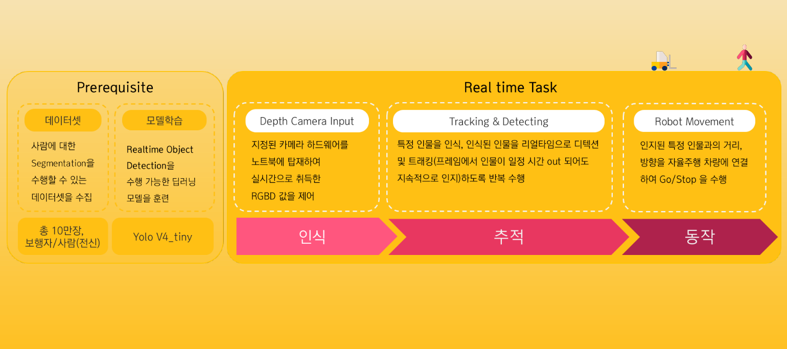
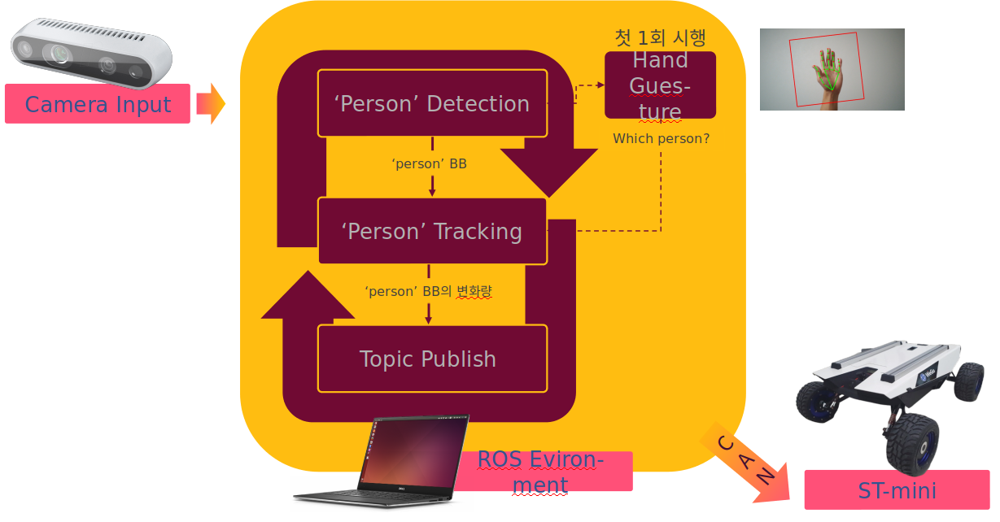

# [ 자율주행 Follow Me 로봇 ]

</br></br>

## 1. 프로젝트 개요

- 프로젝트명 : 자율주행 Follow Me 로봇
- 기업명 : WeGo
- 팀명 : NuGo / 팀원 : 송용호, 김진오, 박정은, 이상미, 주진경
- 프로젝트 기간 : 2021.05.10 ~ 2021. 06.23 (약 2개월)
- 프로젝트 상세 : SSACxAIFFEL 인공지능 혁신학교 Hackathon3
- 프로젝트 과정 : 노션 https://www.notion.so/modulabs/wego-d621c41a171f4f3b8e2e4682bc9bbbdc

</br></br>

## 2. 프로젝트 목표 및 요건

최근 자율주행 로봇과 관련한 서비스들이 출시되며 서빙, 순찰, 방역 등의 역할을 대체하고 있음   
딥러닝 기술을 적용하여 추종하는 Follow Me 로봇을 개발하여 이러한 니즈를 충족하고자 함  

지정된 사용자를 따라 물건을 싣고 이동하는 로봇 수행 요건  

1. 비전 처리를 통해 사람의 모습, 형태를 학습하여 구분 및 인지  
2. Depth 카메라 or LiDar 센서를 사용하여 일정 거리를 유지할 수 있도록 측정  
3. 추적 중간에 방해(대상의 이탈, 새로운 대상의 유입)가 발생하더라도 지정된 대상만 Follow    


</br></br>
## 3. 프로젝트 프로세스



</br></br>

## 4. 알고리즘 개요



</br></br>

## 5. 프로젝트 환경구성

- 주요 환경 구성
  - local 환경 <br>
    Ubuntu 18.4, anaconda
    
  - OpenCV <br>
    opencv-contrib-python, opencv-python
  
  - ROS     <br>
    ros melodic

  - Depth Camera <br>
    pyrealsense2  
  
- pip install 로 환경 구성 

```
$ pip install -r requirements.txt  
```
</br>

## 6-0 프로젝트 실행 환경 구성

0. 해당 레포지토리를 git clone 할 때, 다음과 같은 파일 구조를 갖게 됩니다.


workspace_ros 

​			|_ src

​						|_ scout_mini_ros

​						|_ scripts


1. 프로젝트 실행 환경 구성을 위해, 

   1. catkin workspace 구성
   2. scout_mini_ros 깃허브 clone       

   이 필요합니다.

   먼저, 터미널에서 src 폴더 위치로 이동한 후, 다음의 명령어를 실행하여 1.catkin workspace를 구성합니다. 

```
#catkin 워크스페이스 구성
$ catkin_init_workspace
$ cd ..
$ catkin_make
```

  	이 과정을 수행한 이후, 폴더가 다음 구조로 변화하게 됩니다.

workspace_ros 

​			|_ src

​			|_ build

​			|_ devel

​						|_ scout_mini_ros

​						|_ scripts

이 구조에서,  src 폴더로 이동하여 다음 명령을 수행합니다.

[이곳을 참고하여 실행합니다.](https://github.com/agilexrobotics/scout_mini_ros)

```
$ cd ~/catkin_ws/src
$ git clone https://github.com/agilexrobotics/scout_mini_ros.git
$ cd ..
$ catkin_make
```

이 과정을 수행하면, scout_mini_ros 아래의 scout_bringup 폴더를 확인할 수 있습니다.


__scout_bringup 폴더 아래에 scripts 폴더를 넣어주시면, .py 를 실행하기 위한 환경 구성이 완료__됩니다. 


## 6-1. 프로젝트 실행 방법

스크립트 경로 : 워크스페이스의 /src/scout_mini_ros/scout_bringup 폴더 내에 존재 


```
# local에서 실행하는 경우
$ cd [워크스페이스]/src/scout_mini_ros/scout_bringup/scripts
$ python3  cv_tracking_hand_depth_cam.py
```
</br>

#### ros 위에서 실행
- ros를 사용할 터미널은 <b>`$ source devel/setup.bash`</b>를 반드시 해주어야 한다.
- main으로 사용할 python file 가장 위에 local의 python 환경 위치를 주석으로 적어주어야 한다. </br>
  ex) #! /usr/bin/python 
  - 자신의 python 환경 위치는 터미널에 `$ which python`으로 확인이 가능하다.

</br>

1-1. ROS-STmini 연결 
```
$ cd [워크스페이스]
$ source devel/setup.bash
$ rosrun scout_bringup bringup_can2usb.bash
```

환경 setup 후 ST-mini와 can 통신 연결

```
$ roslaunch scout_bringup scout_minimal.launch 
```


1-2. ROS Gazebo 연결
```
$ cd [워크스페이스]
$ source devel/setup.bash
$ roslaunch scout_bringup scout_mini_base_gazebo_sim.launch
```


2-1. .../scout_bringup/scripts/ 내부 py 파일 실행 

```
$ rosrun scout_bringup cv_tracking_hand_depth_cam.py
```

2-2. 키보드로 조정하고 싶은 경우 

```
roslaunch scout_bringup scout_teleop_keyboard.launch
```

ROS 실행부분은 모두 workspace로 이동한 후 명령어를 사용해야 한다.

</br></br>


## 6-2. 프로젝트 주 동작 file 
- <b>cv_tracking_hand_depth_cam_final.py</b> : tracking 및 detect가 동작하고 ST-mini에 publish되는 main file </br>
- <b>ros_pub.py </b>: ros에 publish를 하는 함수들을 담은 모듈  </br>
- <b>depth_cam_distance.py</b> : depth cam으로 거리와 관련된 함수가 있는 모듈 </br>
- <b>bboxes_utils.py </b> :  bounding box들 간의 조정(iou, distance)을 하는 함수가 있는 모듈 </br>
- <b>realsense_depth.py</b> : Depth Camera와 연결할 때 필요한 pipeline 설정이 있는 모듈 </br>
- <b>hand_depth.py</b> : <b>mediapipe</b>의 솔루션 중에서 hand의 landmark를 그리는 솔루션을 사용, 해당 솔루션으로 손의 gesture 확인하는 모듈 </br>

</br>

## 7. References 

https://arxiv.org/abs/2004.10934

https://github.com/AlexeyAB/darknet

https://github.com/theAIGuysCode/yolov4-deepsort

https://github.com/theAIGuysCode/tensorflow-yolov4-tflite

https://github.com/IvLabs/person_following_bot

https://github.com/kairess/Rock-Paper-Scissors-Machine.git


